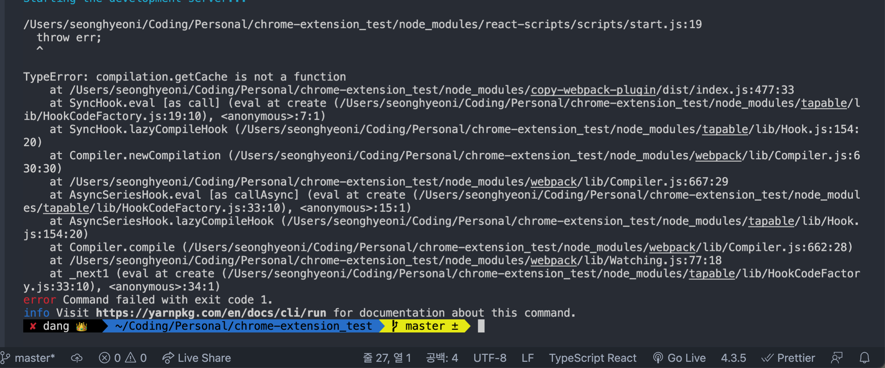

# KUCIS TIL

- 이름: { 김성현 }

- 날짜: { 21-07-14 }

### ⚙️ 오늘 공부한 내용

#### 크롬 익스텐션 구축 테스트

크롬 익스텐션의 경우, Create-React-App 에서 TypeScript 방식으로 프로젝트를 생성해준 다음, Public에 있는 manifest.json을 수정해준 후 build를 진행하여 chrome://extensions에 업로드하면 이용할 수 있다.

```json
{
  "content_security_policy": "script-src 'self' 'unsafe-eval' 'sha256-tUFa7KZZoVYHA0SdMAM6kb/eaxXRx9GpLfFeHIxfaw0='; object-src 'self'",
  "name": "Getting Started Example", //익스텐션 이름
  "version": "1.0", //익스텐션 버전
  "description": "Build an Extension!", //익스텐션 설명
  "manifest_version": 2,
  "browser_action": {
    //브라우저에 생기는 확장프로그램 아이콘에 대한 이미지, 툴팁, 나타낼 페이지 등 설정
    "default_popup": "index.html", //클릭 시 띄울 팝업창이 보여줄 HTML 파일을 설정
    "default_title": "Open the popup" //아이콘의 툴팁(마우스를 올리면 보이는 텍스트)
  },
  "permissions": [], //익스텐션에서 사용할 권한을 설정
  "background": {
    //익스텐션에서 백그라운드로 실행할 스크립트를 지정
    "scripts": ["background.js"],
    "persistent": true
  }
}
```

mainfest 추가 설정 항목

    default_locale : 이 확장프로그램의 기본적인 언어를 설정

        - "_locale" 디렉터리가 존재하는 경우에 설정하고 없으면 이 항목을 제외합니다.

        - 다양한 언어를 제공하기 위한 설정입니다.


    page_action : browser_action과 비슷하다. 확장프로그램이 동작하는 대상 페이지가 분명할 경우에 browser_action 대신 사용

    background : 확장프로그램에서 백그라운드로 실행할 스크립트를 지정

    permissions : 권한 목록 (https://developer.chrome.com/extensions/declare_permissions)

    optional_permissions : 확장프로그램에서 사용할 선택적 권한을 설정

        - 확장프로그램에서 부가적인 기능을 사용하기 위한 선택적인 권한을 설정합니다.

        - 확장프로그램을 사용하기 위한 필수적인 기능(Permissions에 설정)이 아니거나, 추후에 추가적인 권한이 필요할 때 사용합니다.

    options_page : 사용자가 확장프로그램에 대한 설정을 할 수 있는 페이지를 설정합니다.

    update_url : 자동으로 업데이트할 서버를 설정

        크롬 확장프로그램은 주기적으로 version을 확인하여 새 버전이 있을 시 사용자의 개입 없이 업데이트합니다.

    commands : 확장프로그램에서 동작하는 키보드 단축키를 설정

        - 단축키 설정으로 지원되는 키 : 알파벳, 숫자, ','(콤마), PageUP, PageDown, Home, End, Insert, Delete, Space Bar, 화살표, '>' 등

        - 모든 단축키에는 Ctrl 또는 Alt가 포함되어야 합니다. 단 Ctrl+Alt는 허용되지 않습니다.

정상적으로 빌드에 성공하게 되면 src에 있는 App.tsx가 팝업에 출력되게 된다.

#### 셋팅 도중 이슈 발생 모음

1. content_security_policy

   

인터넷에 있는 셋팅대로 manifest를 수정하다보면 content_security_policy 관련해서 오류가 발생하는데, 위에 적어둔 코드를 작성하면 된다. sha-256키는 오류에서 나온 메시지를 참고하여 작성하면 된다.

    content_security_policy(CSP) : XSS 공격을 막기 위해서 사용한 정책
    익스텐션에서 로드되거나 실행되는 컨텐츠의 범위를 제한하는 방법으로 동작하며,
    블랙리스트 방식과 화이트리스트 방식을 모두 적용할 수 있다.

2. 다른 블로그 예제 활용중 빌드 오류


https://jungpaeng.tistory.com/79 에 있는 과정을 동일하게 따라하면, 캐시관련해서 계속 오류가 발생하였다. 아직 원인을 제대로 분석을 하지 못해 일단은 보류중인 상태이다.

### ⚙️ 회고

우선 실제로 클론코딩을 진행해보면서 manifest에 대한 간단한 구조를 알게 된 것 같다. 추후에는 permission에 대한 부분을 더욱 자세히 알아보고, 실습을 진행해 볼 예정이며, 자주 사용하던 익스텐션중에 "grammaly"라는 익스텐션이 있는데, 이 익스텐션은 영어를 작성할 때 문법을 검사해주고, 오류가 있는 부분을 페이지 안에서 빨갛게 밑줄을 치고 그 밑줄을 클릭하면 팝업이 떠 수정을 할 수 있게 해준다. 이 기능에 대한 조사도 추후에 진행해볼 예정이다.
마지막으로, 아는 선배중에 과제로 관련 프로젝트를 진행(좀 옛날)해서 발표자료나 보고서, 그리고 백앤드, 프론트앤드 작업을 한 코드들을 제공받았다. 이것도 공부해볼 예정이다.
