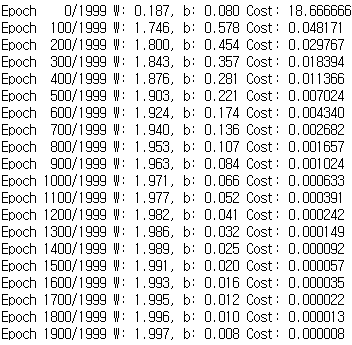

# KUCIS TIL

- 이름: 허준서
- 날짜: 21-07-06

### ⚙️ 오늘 공부한 내용

# Linear Regression (선형 회귀)

Tech Stack: Pytorch
수정날짜: 2021년 7월 7일 오후 1:52
작성날짜: 2021년 6월 17일 오후 10:45

# 기본 세팅

---

```python
import torch
import torch.nn as nn
import torch.nn.functional as F
import torch.optim as optim
```

사용할 모듈을 위와 같이 import 해준다.

 

```python
torch.manual_seed(1)
```

랜덤 시드를 1로 고정해서, 랜덤 값이 항상 같은 값이 나오도록 해준다. 이 경우 다른 컴퓨터에서 이 코드를 실행해도 같은 랜덤 값을 가지게 된다.

# 데이터 설정

---

```python
x_train = torch.FloatTensor([[1], [2], [3]])
y_train = torch.FloatTensor([[2], [4], [6]])
```

데이터를 위와 같이 선언해주고 가설은 $y = Wx + b$ 로 설정하자. 사실 위 데이터에서 목적함수는 y = 2x 라는 걸 쉽게 알 수 있긴 하다.

```python
W = torch.zeros(1, requires_grad=True)
b = torch.zeros(1, requires_grad=True)
```

가중치와 편향을 각각 0으로 초기화하고 requires_grad = True로 설정한다. 이는 두 변수가 학습을 통해 값이 변경되는 변수임을 의미한다.

```python
hypothesis = x_train * W + b
cost = torch.mean((hypothesis - y_train) ** 2)
```

가설을 설정하고 비용함수(평균 제곱 오차)를 설정해준다.

```python
optimizer = optim.SGD([W, b], lr=0.01) #확률적 경사 하강법 사용
cost.backward() #비용함수를 미분하여 기울기 계산
optimizer.step() #W와 b 업데이트
```

확률적 경사 하강법을 통해 W와 b를 최적화해준다.

```python
x_train = torch.FloatTensor([[1], [2], [3]])
y_train = torch.FloatTensor([[2], [4], [6]])

W = torch.zeros(1, requires_grad=True)
b = torch.zeros(1, requires_grad=True)

optimizer = optim.SGD([W, b], lr=0.01)

nb_epochs = 1999
for epoch in range(nb_epochs + 1):

    hypothesis = x_train * W + b
    cost = torch.mean((hypothesis - y_train) ** 2)

    optimizer.zero_grad()
    cost.backward()
    optimizer.step()

    # 100번마다 로그 출력
    if epoch % 100 == 0:
        print('Epoch {:4d}/{} W: {:.3f}, b: {:.3f} Cost: {:.6f}'.format(
            epoch, nb_epochs, W.item(), b.item(), cost.item()
        ))
```



전체코드와 실행결과는 위와 같다.

# 단순 선형 회귀 구현하기

---

아까는 가설과 비용함수를 직접 설정해서 선형 회귀 모델을 구현했지만, 이번에는 파이토치에서 제공하는 모듈을 이용해본다.

- 모듈 임포트 및 랜덤시드 고정

```python
import torch
import torch.nn as nn
import torch.nn.functional as F
torch.manual_seed(1)
```

- 데이터 생성

```python
x_train = torch.FloatTensor([[1], [2], [3]])
y_train = torch.FloatTensor([[2], [4], [6]])
```

- 모듈 생성

```python
model = nn.Linear(1,1)
```

여기서 인자로 1,1을 넘겨주었으므로 단순 선형 회귀 모델이 되며, model에는 가중치와 편향이 저장되어있다. 이 값은 model.parameters()를 이용해 확인할 수 있다.

```python
print(list(model.parameters()))
```

[Parameter containing:
tensor([[0.5153]], requires_grad=True), Parameter containing:
tensor([-0.4414], requires_grad=True)]

현재는 랜덤한 값이 들어가있다.

- 옵티마이저 생성

```python
optimizer = torch.optim.SGD(model.parameters(), lr=0.01)
```

learning rate가 0.01이고 확률적 경사하강법을 이용하는 옵티마이저를 설정한다. model.parameters()를 이용해 W와 b를 전달한다.

```python
nb_epochs = 2000
for epoch in range(nb_epochs+1):

    # H(x) 계산
    prediction = model(x_train)

    # cost 계산
    cost = F.mse_loss(prediction, y_train) # <== 파이토치에서 제공하는 평균 제곱 오차 함수

    # cost로 H(x) 개선하는 부분
    # gradient를 0으로 초기화
    optimizer.zero_grad()
    # 비용 함수를 미분하여 gradient 계산
    cost.backward() # backward 연산
    # W와 b를 업데이트
    optimizer.step()

    if epoch % 100 == 0:
    # 100번마다 로그 출력
      print('Epoch {:4d}/{} Cost: {:.6f}'.format(
          epoch, nb_epochs, cost.item()
      ))
```


전체 코드와 실행결과는 위과 같다.

학습이 끝난 후 W와 b값을 확인해보면 아래와 같다.


# Autograd (자동미분)

---

신경망을 학습할 때 가장 자주 사용되는 알고리즘들 중 하나인 `역전파`는, 매개변수에 대한 손실함수의 변화도에 따라 매개변수를 적절히 조정하는 과정을 거친다.

이때 손실함수의 변화도를 계산하기 위해 그 함수를 미분해야하는데, 파이토치에는 이를 자동으로 해주는 `autograd`라는 기능이 있다.

```python
import torch

x = torch.ones(5)  # input tensor
y = torch.zeros(3)  # expected output
w = torch.randn(5, 3, requires_grad=True)
b = torch.randn(3, requires_grad=True)
z = torch.matmul(x, w)+b
loss = torch.nn.functional.binary_cross_entropy_with_logits(z, y)

print('Gradient function for z =', z.grad_fn)
print('Gradient function for loss =', loss.grad_fn)
```

Gradient function for z = <AddBackward0 object at 0x0000020593EBE278>
Gradient function for loss = <BinaryCrossEntropyWithLogitsBackward object at 0x0000020593EBE208>

- 입력 x, 매개변수 w와 b, 손실함수 loss를 위와 같이 설정하자. w와 b를 선언할 때 requires_grad=True를 넘겨주는 걸 볼 수 있는데, 이렇게 하면 해당 변수에 대한 손실 함수의 변화도를 계산할 수 있게 된다.
- `Function 클래스`내에 정의된 함수를 텐서에 적용함으로써 loss 함수를 정의한다. Function 클래스의 객체는 순전파방향으로 함수를 계산하는 방법과 역전파방향으로 도함수를 계산하는 방법을 알고 있다. 이때 역전파 함수에 대한 참조는 텐서의 `grad_fn`에 저장된다.

### 변화도(Gradient) 계산하기

신경망에서 매개변수를 최적화하려면 손실함수의 도함수를 계산해야한다. 위에서 loss함수는 w와 b에 대한 함수이므로, x와 y의 값이 고정된 상태에서 w와 b에 대한 편미분 값이 필요하다.

```python
loss.backward()
print(w.grad)
print(b.grad)
```

```
tensor([[0.0101, 0.2905, 0.2432],
        [0.0101, 0.2905, 0.2432],
        [0.0101, 0.2905, 0.2432],
        [0.0101, 0.2905, 0.2432],
        [0.0101, 0.2905, 0.2432]])
tensor([0.0101, 0.2905, 0.2432])
```


- 파이썬의 requests와 beautifulsoup 모듈을 이용해 웹페이지의 script 태그 내용 크롤링

```python
import requests
from bs4 import BeautifulSoup

url = 'https://www.naver.com/'
html = requests.get(url).text
soup = BeautifulSoup(html, 'html.parser')

lists = soup.find_all("script")
for i in lists:
    print(i)
```


# References

---

[https://tutorials.pytorch.kr/beginner/basics/autogradqs_tutorial.html](https://tutorials.pytorch.kr/beginner/basics/autogradqs_tutorial.html)